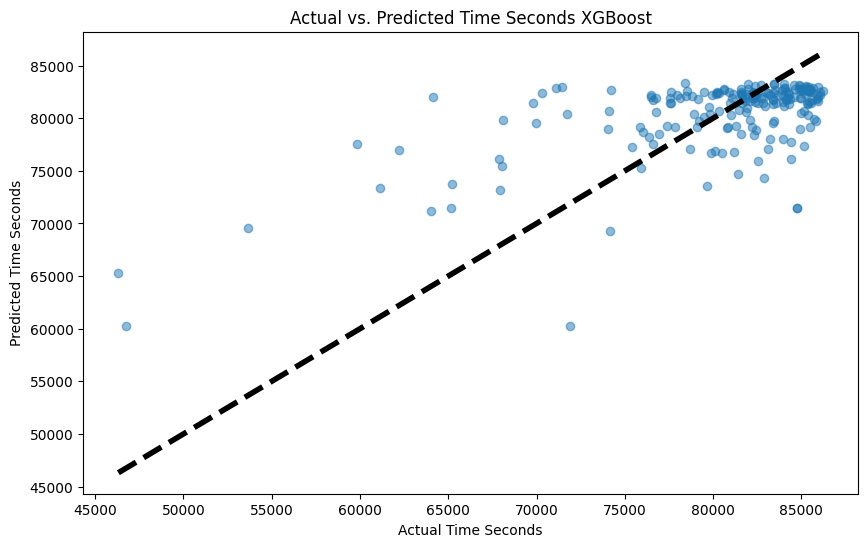
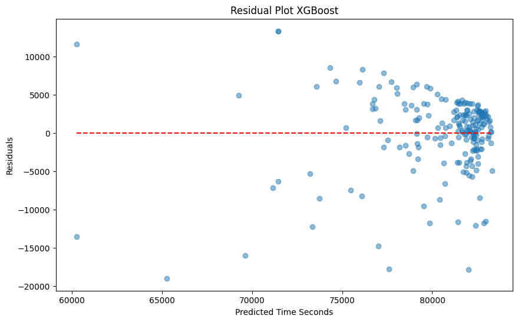

# Bob Graham Round Prediction

Aims to predict the finishing time of someone attempted to complete a Bob Graham Round based on their previous race results. To use, enter the runner id (from the DUV site) for a runner you wish to choose to predict.

The code obtains a list of the current finishers via the Bob Graham API (http://bobgrahamclub.org.uk/api/data_bgr_listing.csv), along with their finishing time, and scrapes the DUV ultramarathon database (https://statistik.d-u-v.org/index.php) to obtain the race results for each of these finishers. A random forest and XGBoost model is then trained on features for each runner with the target of predicting their BGR finish time. The RF model appeared to provide greater accuracy based on the current features.

