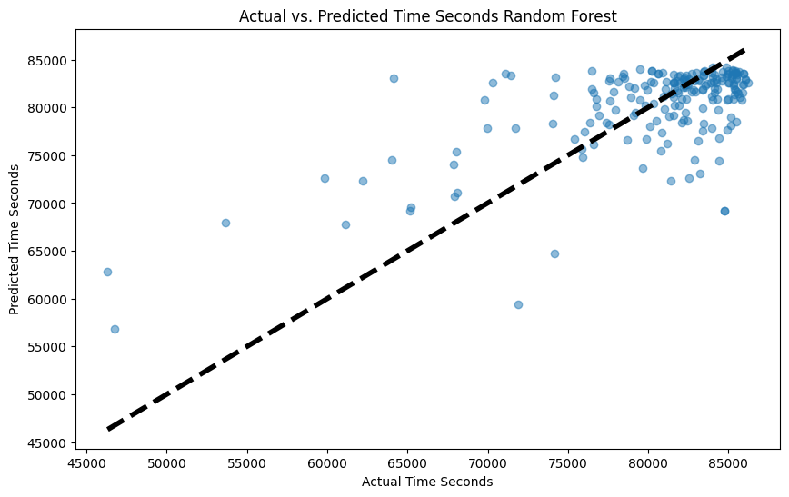
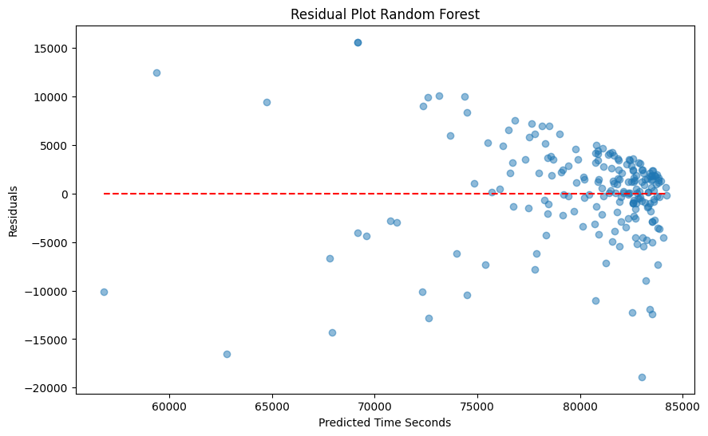

# Bob Graham Round time prediction

Aims to predict the finishing time of someone attempted to complete a [Bob Graham Round](https://en.wikipedia.org/wiki/Bob_Graham_Round) based on their previous race results. To use, enter the runner id (from the DUV site) for a runner you wish to choose to predict.

The code obtains a list of the current finishers via the Bob Graham API (http://bobgrahamclub.org.uk/api/data_bgr_listing.csv), along with their finishing time, and scrapes the DUV ultramarathon database (https://statistik.d-u-v.org/index.php) to obtain the race results for each of these finishers. A number of models are then trained on features for each runner with the target of predicting their BGR finish time. Models included are:

- Random Forest
- Polynomial Regression
- XGBoost
- Support vector regression
- Neural Network

The RF model providided greatest accuracy (RMSE) based on the current features, with a neural net having the lowest accuracy after a bit of playing around with model architectures. This is somewhat expected given the low number of training samples. 

Below shows the predictions of the various models for a specific runner (980130) who ended up completing the Bob Graham round in 22:57, so exactly inline with the SVR model. This may have been more luck than anything though as the error rate for this model in the test set was greater than that of the Random Forest.

| model                | prediction (hms) 	  |
|----------------------|----------------------|
| Random Forest        | 21:33:07             |
| XGBoost              | 20:51:02             |
| SVR                  | 22:56:38             |
| Polynomial Regression| 22:38:46             |
| Neural Network       | 14:34:23             |

